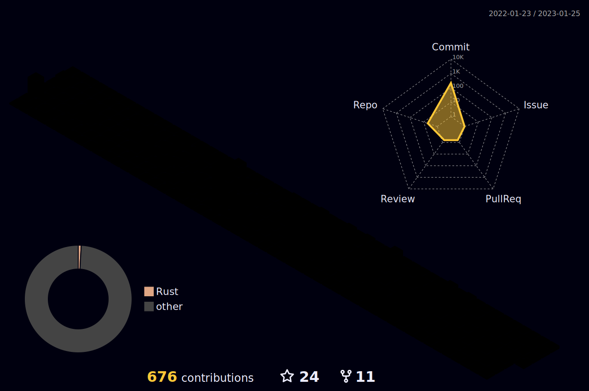

## Hi there, I am Hakan 👋

&nbsp;
&nbsp;

:computer: I'm a Full Stack Developer and Team Leader from **Ankara, Turkey** 

I :heart: **Clean Code** 

&nbsp;&nbsp;&nbsp;&nbsp;

### Working with...

#### Tools

#### Back-End

#### Front-End

#### Databases

#### Environment

&nbsp;
&nbsp;
&nbsp;

  

<!--

-->

